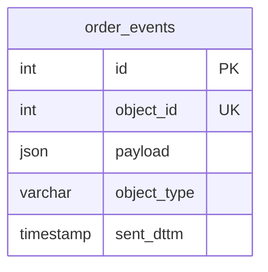
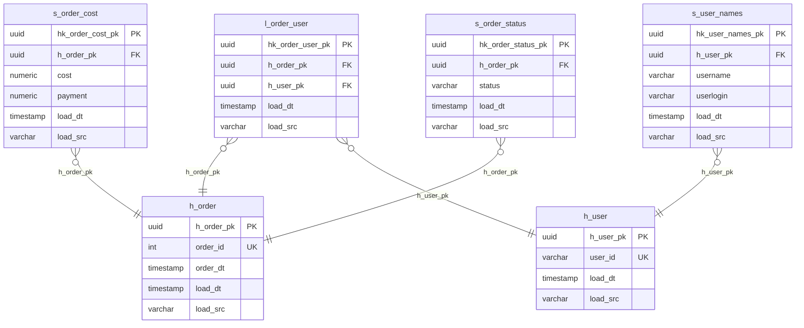
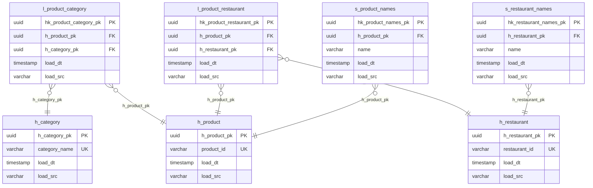
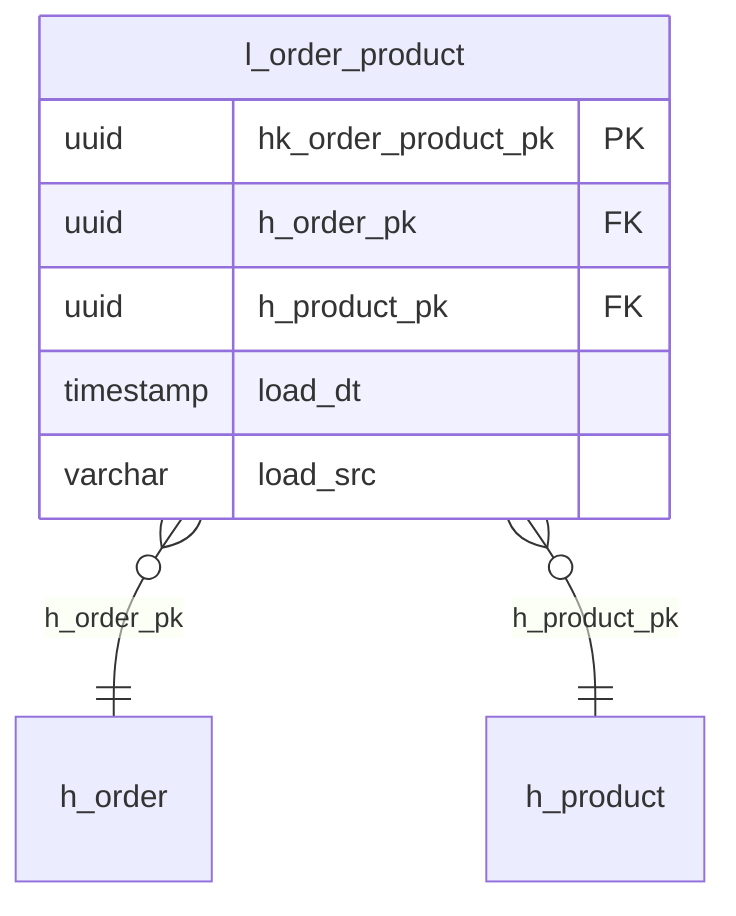
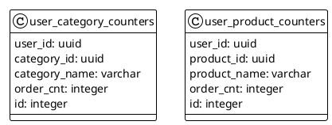

# Проектная работа по облачным технологиям

## Бизнес требования

Разработать облачный DWH для тегирования пользователей приложения - для повышения эффективности рекламных акций.

Маркетинг будет проводить кампании, заточенные под гостей с определённым тегом. Все расчёты ведутся только по заказам со
статусом CLOSED. В каждом заказе есть категория. Для этих категорий будут заведены счётчики с конкретными порогами. При
превышении порога гостю записывается тег.

## Функциональные требования

Входные данные: 
1. Информация по заказам — это потоковые данные, которые будут передаваться через брокер сообщений в
формате JSON.
2. Справочные данные — извлекаются из хранилища ключ-значение.

Выходные данные: 
- Первая витрина — счётчик заказов по блюдам; 
- вторая — счётчик заказов по категориям товаров.

## Нефункциональные требования

- Нагрузка на систему заказов — 5 заказов в минуту.  
- На старте загрузят историю за неделю — 50 000 заказов сразу.
- Обеспечить идемпотентность обработки сообщений из брокера.
- Суммарный бюджет на весь проект не должен превышать 5000 рублей в месяц.
- Использовать технологии, которые позволят легко масштабировать сервис в будущем.
- Нужно оставить возможность переходить из одного облака в другое.

## Технологии

- Kafka - брокер сообщений
- Redis - хранение справочных данных
- PostgreSQL - DWH
- YandexCloud - облачный провайдер
- DataLens - визуализация данных
- Python - обработка данных
- Kubernetes - назначение сервисов

## Общая схема системы

## Описание данных

### Staging-слой (STG)

STG Слой с исходными данными as is — источник правды.

### Detail Data Store (DDS)

DDS Слой детализированных данных для сбора в удобном для управления виде.

Модель DDS Data Vault.

### Common Data Marts (CDM)

CDM Общие витрины для заказчика.

## Логика работы сервисов

### Service STG

### Service DDS

### Service CDM
